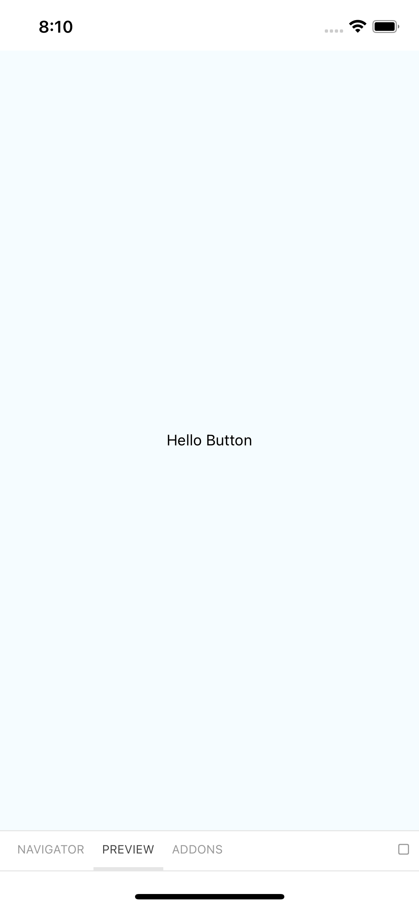
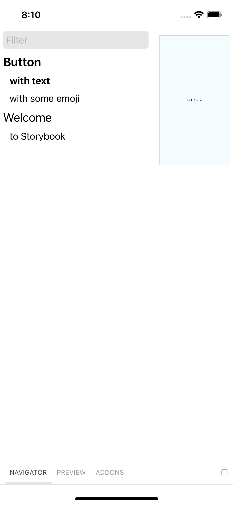
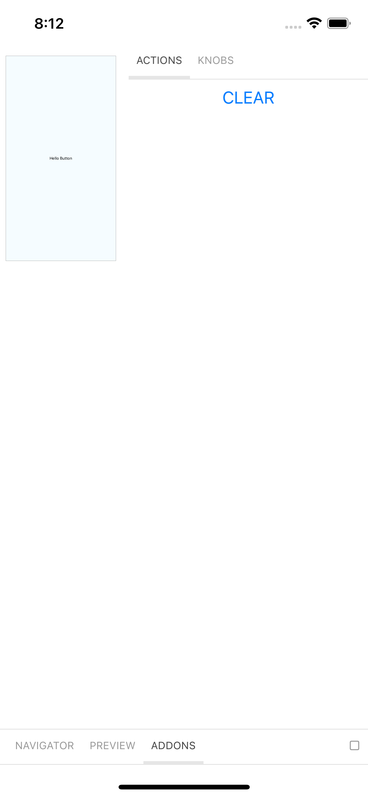
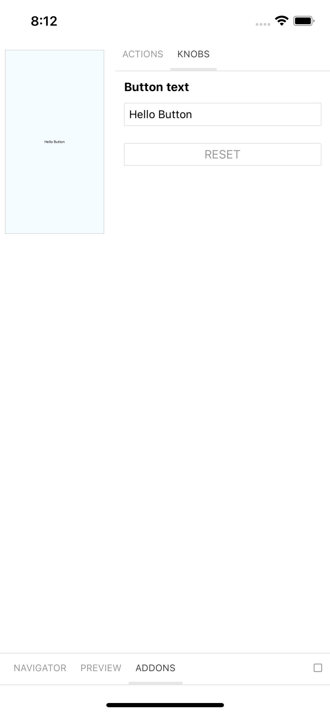
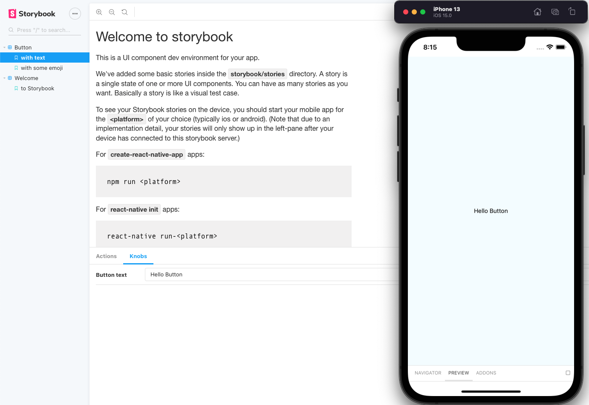
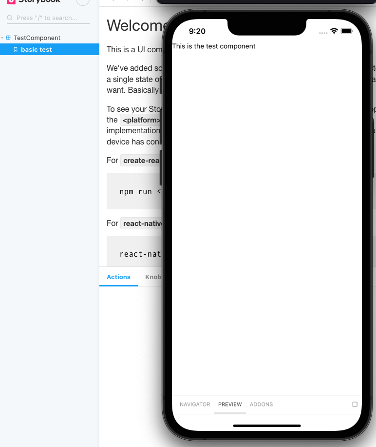

## Creating an app with external component library (hosted on github)


1. Create 2 repositories, one for the app itself and another one that has our component library and storybook

2. On the app repo initialize a new React Native app (vanilla or expo), make a commit and push it

3. Now move on to the components repo  
  3.1. run `npx create-react-native-library <lib_name>`  
  3.2. choose a name for the package, add description, author, urls...  
  3.3. for the languages we will select JavaScript only, because this component library won't have native implementation  
  3.4. since this is a simple example, we'll stick with expo  
  3.5 commit and push

4. Make sure both projects are working properly, on the app project run `yarn ios` or `yarn android`, after getting it to work, close expo bundler and run the components project running `yarn` or `npm i` and then `yarn example ios` or `yarn example android`


## Configuring storybook on our components project
All right, now that we have all set, let's start by adding storybook to our project and getting it to work properly with a test component.

I'll be using [this article](https://blog.logrocket.com/build-a-react-native-component-library-with-storybook/) as a base for our configuration

First things first, our lib code (our components) will be located at `./src`, and we also have a "test project" that is located under `./example`. If you take a closer look, react native builder bob has already added a sample code for us.  
`./src/index` contains a sample function an it's being imported on `./example/src/App.tsx` (or similar path).  
What you need to know is that just the code under `./src` will be shipped with the lib, taking a look at the `./package.json` you'll notice a script for builder bob  
```"react-native-builder-bob": {
    "source": "src", // where our lib code is located
    "output": "lib",
    ...
```

1. enter the example project directory `cd example`

2. run `npx -p @storybook/cli sb init --type react_native`  
   1. This initializes the storybook on any given app
   2. Confirm the installation for storybook server
   3. When the installation ends you should see a note saying to replace the app's entry with some code, we'll do that later, proceed to next step

3. run `yarn add -D react-native-storybook-loader`
   1. RN story loader helps us to update the changes to our storybook stories automatically, because storybook relies on a file that exports all our stories, an this automatically generates that file

4. Add this script to `./example/package.json`:
   ```
   "scripts": {
      ...other scripts,
      "prestorybook": "rnstl"
    }

5. That script will be run before you run `yarn storybook`, since we are on `package.json`, let's take a closer look on what storybook has changed  
      `"storybook": "start-storybook -p 7007",` - This script is responsible for running the storybook server, it will open the browser on localhost:7007, since we are using the react native version of storybook that page won't be much useful for us at the moment  
      `"build-storybook": "build-storybook",` - This script will build a static page for displaying our components, we are not interested on that script for now

6. Time to use the information storybook gave us after the installation  
    1. replace all the content of `./example/src/App.tsx` with:
    ```
    import React from 'react';
    export { default } from '../storybook';

7. Ok, now it's time to test our app with storybook,  
    1. On one terminal open `./example` and run `yarn storybook`  
    2. On another terminal run `yarn ios` if you are at `./example` or `yarn example ios`
    3. The app will look a little different than we are used to, so let me explain what is going on  
        
        The app is rendering what is being exported on `../storybook` remember? That file is just exporting a Storybook component - getStorybookUI - with some initialization, such as the stories it should render on the app.  
        
        The stories are located at `./example/storybook/stories`, there is an index file to export all our stories and there are 3 folders, one for each of our stories.  

        Taking a look at the Button, the index file contains the code for the component, as we are used to, and there is a file called `Button.stories.js`. This file contains the stories for our component, you could think of a story as a variation of our component, or a test of our component, we are able to create a lot of stories for a given component. To have a better understanding on how storybook works, go to [this link](https://storybook.js.org/docs/react/get-started/introduction).  

        This is where our current selected story will render.  
        

        The navigation section shows all our stories and component stories, on selection, the preview will render the selected story.  
        

        The Addons section has two subsections by default, the first one is called "actions" and display the logs for onPresses that were executed by the component  
        

        The second subsection is called "knobs", this is where you are able to change component props on the fly.  
        

        Finally, there is the website, that won't be of much help for us, it displays all the stories and addons we have, and works the same as the in-app controls.  
        

8. Remember to make a commit and push our current code (on lib root folder, not on `./example`)

9. To really make use of rnstl we need to update our storybook index file `./example/storybook/index.js`  
    import  
    ```
    import { loadStories } from './storyLoader'
    ```  
    and  
    ```
    configure(() => {
      require('./stories'); <--- change to: loadStories();
    }, module);
    ```  

## Custom location for components

Until now, we were using the components and stories in the folders that storybook created for us, let's make it our own.  

1. Remove the current stories (folders) we have under `./example/storybook/stories` and delete the content from `./example/storybook/stories/index.js`, because the files no longer exist.

2. Create the following files:  
 export our components - `./src/components/index.ts`  
 ```
  export { default as TestComponent } from './TestComponent';
 ```  

 the component - `./src/components/TestComponent/index.tsx`  
 ```
  import { Text, View } from 'react-native';
  import React from 'react';

  const TestComponent = () => {
    return (
      <View>
        <Text>This is the test component</Text>
      </View>
    );
  };

  export default TestComponent;
  ```  

  component stories - `./example/storybook/stories/TestComponent/TestComponent.stories.tsx`
  ```
  import React from 'react';
  import { TestComponent } from '../../../../src/components';
  import { storiesOf } from '@storybook/react-native';

  storiesOf('TestComponent', module).add('basic test', () => <TestComponent />);
  ```  

  export the stories - `./example/storybook/stories/index.js`
  ```
  import './TestComponent/TestComponent.stories';
  ```  

  export all our components and other functions related to the library - `./src/index`
  ```
  export * from './components'
  ```  

3. Now you should be able to run `yarn storybook` and `yarn storybook` again and see something like this:  

  

4. Make a commit if you want to, and let's get started on how to add this library to our app project.

## Adding library component to other projects

Let's get back to our initial app project, not the one made with builder bob.  
The component library should be on a remote repository already, to add it to you project run:
```
yarn add <lib_repo_url>
```  
in my case `yarn https://github.com/caiorrs/component-lib`  

you may have access issues, then you would need to use an account with access to that repo, I recommend using ssh keys and installing the lib using the ssh url.  

To test if it worked, go to some screen on your app and add  
```
import {TestComponent} from 'component-lib'
```

"component-lib" is the name I gave to my library, you could check it on `package.json`  
Use it as you developed, e.g. `<TestComponent />`

  

# :tada: Congratulations!

You've just made a component library using storybook!  
Take some time to study about storybook, and I would recommed you to use some scaffolding tool for the library repo. I have little experience with that kind of tool, but I liked [plop](https://github.com/plopjs/plop) a lot.  

I also recommend [this](https://dev.to/ugglr/step-1-setting-up-react-native-with-storybook-36l) other article